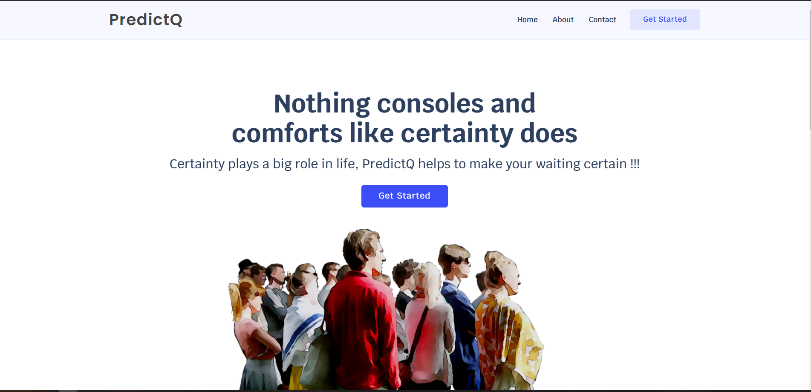
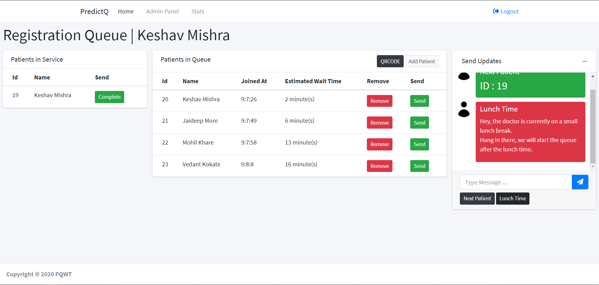
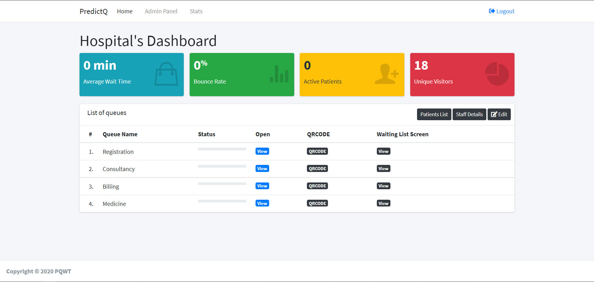
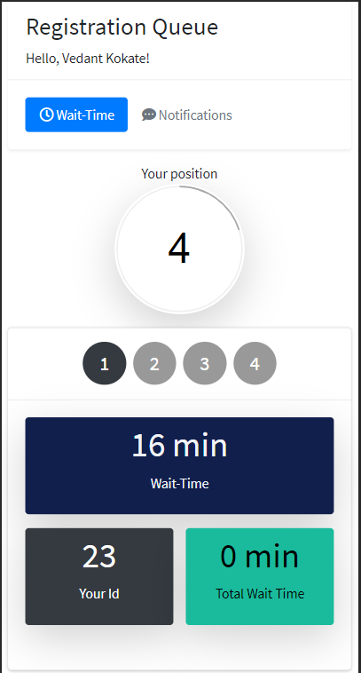

# PredictQ
> Nothing consoles and comforts like certainty does

PredictQ is an all-inclusive queue management solution catering to both the patients and the hospital. A patient was given access to all the relevant data like predicted wait time, queue name, queue position, and announcement right from one click. Hospitals were allowed to micromanage the queues, get performance reports of machine learning models and send announcements to patients.

## Setup

Use the package manager [pip](https://pip.pypa.io/en/stable/)

```bash
pip install -r requirements.txt
```

## Screenshots 

 
 
 


## Contributing
Pull requests are welcome. For major changes, please open an issue first to discuss what you would like to change.
